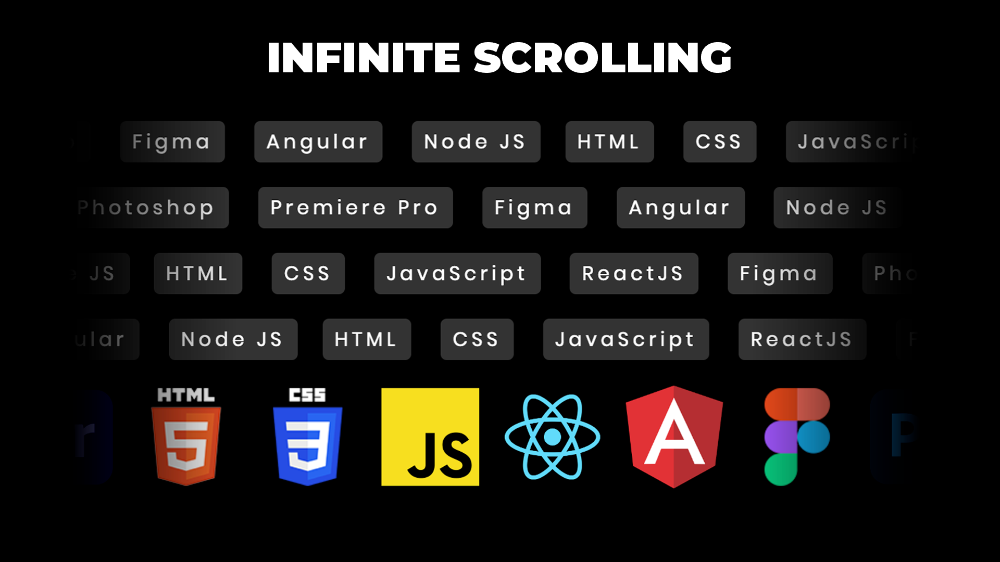

# Infinite Horizontal Scroll Animation | Infinite Scrolling Animation CSS Only

An infinite horizontal scroll animation created using CSS only is a dynamic visual effect that animates content horizontally, creating the illusion of an endless scroll. This technique is implemented without the use of JavaScript, relying solely on CSS keyframe animations and transitions. By employing keyframe animations, developers can continuously move the content horizontally, creating a seamless and perpetual scrolling effect. This approach is often used to showcase a series of images, text, or other content in a captivating and interactive manner, providing a unique and engaging user experience. Infinite horizontal scroll animations can be customized to match the design aesthetics of a website, offering a creative way to present information and capture the attention of website visitors. This technique is commonly applied in various web design elements, such as image carousels, galleries, or continuous storytelling interfaces, to deliver an immersive and visually stimulating user interface.

Youtube Tutorial Link: https://youtu.be/0QI4ymWwpG0

Live Preview: https://infinitescroll-six.vercel.app/

